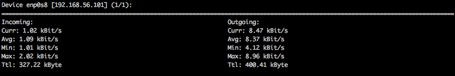
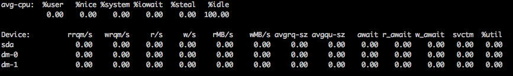
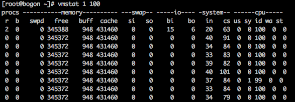
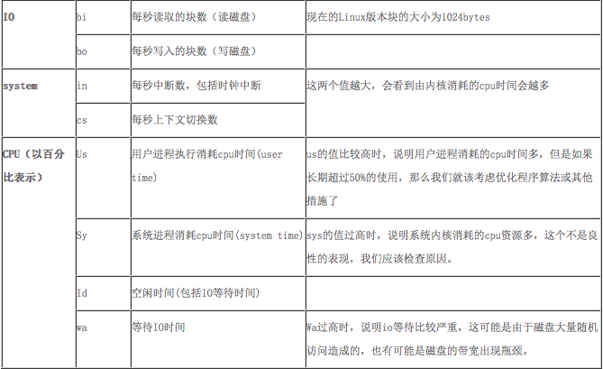
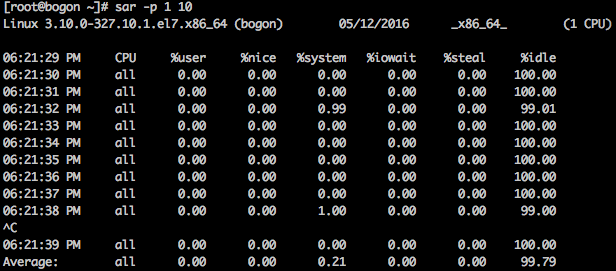

---
---

  

  

  

  

  

  

---
---
- 场景描述：
	由于游戏登录充值服务，需要压测承压能力，使用LNMP+MONGO+REDIS 所以简单罗列一下，需要用到的点。
- 安装工具
	- yum install  nload.x86_64 -y
	- yum install  sysstat -y
- 监控性能点：
	- 网络IO
		-  nload -m
				
	- 磁盘IO
		-  iostat -m -x 1 100
		
		
		-  第一部分包含了CPU报告
		
			    %user : 显示了在执行用户(应用)层时的CPU利用率
			    %nice : 显示了在以nice优先级运行用户层的CPU利用率
			    %system : 显示了在执行系统(内核)层时的CPU利用率
			    %iowait : 显示了CPU在I/O请求挂起时空闲时间的百分比
			    %steal : 显示了当hypervisor正服务于另外一个虚拟处理器时无意识地等待虚拟CPU所占有的时间百分比。
			    %idle : 显示了CPU在I/O没有挂起请求时空闲时间的百分比
		
		-  第二部分包含了设备利用率报告
		
			    Device : 列出的/dev 目录下的设备/分区名称
			    tps : 显示每秒传输给设备的数量。更高的tps意味着处理器更忙。
			    Blk_read/s : 显示了每秒从设备上读取的块的数量(KB,MB)
			    Blk_wrtn/s : 显示了每秒写入设备上块的数量(KB,MB)
			    Blk_read : 显示所有已读取的块
			    Blk_wrtn : 显示所有已写入的块
		- 注意说明
		
				如果 %util接近 100%，说明产生的 I/O请求太多， I/O系统已经满负荷，
				该磁盘可能存在瓶颈， idle小于 70% IO压力就较大了 ,一般读取速度有较
				多的 wait。同时可以结合 vmstat（ virtual memory status）查看 
				b参数 (等待资源的进程数 )和 wa参数 (IO等待所占用的 CPU时间的百分
				比 ,高过 30%时 IO压力高 )

	- 内存
		-  vmstat 1 100
		
			   
			
		-  参数说明
		
			   
			   
		-  可用内存：free+buffers+cached 
		-  已用内存：userd-buffers-cached   
		-  注意说明
		
				如果r经常大于4，且id经常少于40，表示cpu的负荷很重。
				
				如果pi，po长期不等于0，表示内存不足。
				
				如果disk经常不等于0，且在b中的队列大于3，表示io性能不好。
				
				1.)如果在processes中运行的序列(process r)是连续的大于在系统中的
				CPU的个数表示系统现在运行比较慢,有多数的进程等待CPU。
				
				2.)如果r的输出数大于系统中可用CPU个数的4倍的话,则系统面临着CPU短缺
				的问题,或者是CPU的速率过低,系统中有多数的进程在等待CPU,造成系统中进
				程运行过慢。
				
				3.)如果空闲时间(cpu id)持续为0并且系统时间(cpu sy)是用户时间的两
				倍(cpu us)系统则面临着CPU资源的短缺。
				
	- CPU
		-  sar -p 1 10
		
		      
		
		- 输出项说明：

				CPU：all 表示统计信息为所有 CPU 的平均值。
				%user：显示在用户级别(application)运行使用 CPU 总时间的百分比。
				%nice：显示在用户级别，用于nice操作，所占用 CPU 总时间的百分比。
				%system：在核心级别(kernel)运行所使用 CPU 总时间的百分比。
				%iowait：显示用于等待I/O操作占用 CPU 总时间的百分比。
				%steal：管理程序(hypervisor)为另一个虚拟进程提供服务而等待虚拟
				CPU 的百分比。
				%idle：显示 CPU 空闲时间占用 CPU 总时间的百分比。
				
				1. 若 %iowait 的值过高，表示硬盘存在I/O瓶颈
				2. 若 %idle 的值高但系统响应慢时，有可能是 CPU 等待分配内存，此时
				应加大内存容量
				3. 若 %idle 的值持续低于1，则系统的 CPU 处理能力相对较低，表明系
				统中最需要解决的资源是 CPU 。
	- 进程队列长度和平均负载状态
		- sar -q 10 3

		- 屏幕显示如下：

				19:25:50 runq-sz plist-sz ldavg-1 ldavg-5 ldavg-15
				
				19:26:00 0 259 0.00 0.00 0.00
				19:26:10 0 259 0.00 0.00 0.00
				19:26:20 0 259 0.00 0.00 0.00
				
				Average: 0 259 0.00 0.00 0.00

		- 输出项说明：

				runq-sz：运行队列的长度（等待运行的进程数）
				plist-sz：进程列表中进程（processes）和线程（threads）的数量
				ldavg-1：最后1分钟的系统平均负载（System load average）
				ldavg-5：过去5分钟的系统平均负载
				ldavg-15：过去15分钟的系统平均负载
				
	- inode、文件

		- sar -v 10 3

		- 屏幕显示如下：

				17:10:49 dentunusd file-nr inode-nr pty-nr
				17:10:59 6301 5664 12037 4
				17:11:09 6301 5664 12037 4
				17:11:19 6301 5664 12037 4
				
				Average: 6301 5664 12037 4

		- 输出项说明：
				
				dentunusd：目录高速缓存中未被使用的条目数量
				file-nr：文件句柄（file handle）的使用数量
				inode-nr：索引节点句柄（inode handle）的使用数量
				pty-nr：使用的pty数量
				
---
---				
				

  

  

  

  

  

  

	
---
---
#### PHPFPM NGINX
	- php性能监控
	
		- phpfpm 配置
	
				pm.status_path = /phpstatus
	
	
		- nginx配置
			
				location ~ ^/phpstatus$ {
			        fastcgi_pass   127.0.0.1:9000;
			        #fastcgi_index  index.php;
			        fastcgi_param  SCRIPT_FILENAME $fastcgi_script_name;
			        include        fastcgi_params;
			    }
			    
		- http://192.168.56.101/phpstatus
		- 屏幕显示
		
				pool:                 www
				process manager:      dynamic
				start time:           12/May/2016:19:48:33 +0800
				start since:          9111
				accepted conn:        3
				listen queue:         0
				max listen queue:     0
				listen queue len:     128
				idle processes:       4
				active processes:     1
				total processes:      5
				max active processes: 1
				max children reached: 0
				slow requests:        0

	   - php-fpm status详解
	 
				pool – fpm池子名称，大多数为www
				process manager – 进程管理方式,值：static, dynamic or 
				ondemand. dynamic
				start time – 启动日期,如果reload了php-fpm，时间会更新
				start since – 运行时长
				accepted conn – 当前池子接受的请求数
				listen queue – 请求等待队列，如果这个值不为0，那么要增加FPM的进程
				数量
				max listen queue – 请求等待队列最高的数量
				listen queue len – socket等待队列长度
				idle processes – 空闲进程数量
				active processes – 活跃进程数量
				total processes – 总进程数量
				max active processes – 最大的活跃进程数量（FPM启动开始算）
				max children reached - 大道进程最大数量限制的次数，如果这个数量
				不为0，那说明你的最大进程数量太小了，请改大一点。
				slow requests – 启用了php-fpm slow-log，缓慢请求的数量
				
	- nginx性能监控
	
		- nginx配置
	
			   	location /nginxstatus {
			        stub_status on;
			        access_log off;
			        #allow 127.0.0.1;
			        #deny all;
			    }
	   - http://192.168.56.101/nginxstatus
	   - 屏幕显示
	   
			   		Active connections: 11921 
					server accepts handled requests
					 11989 11989 11991 
					Reading: 0 Writing: 7 Waiting: 42

	   - nginx status详解
	   
				active connections – 活跃的连接数量
				server accepts handled requests — 总共处理了11989个连接 ,
									 成功创建11989次握手, 总共处理了11991个请求
				reading — 读取客户端的连接数.
				writing — 响应数据到客户端的数量
				waiting — 开启 keep-alive 的情况下,这个值等于 active – (reading
				+writing), 意思就是 Nginx 已经处理完正在等候下一次请求指令的驻留连接.
				
	
---
---				
				

  

  

  

  

  

  

	
---
---
	
#Mongodb
	- mongotop
	
       		ns                           total        read       write
       		mostconfig.business_except    0ms         0ms         0ms
              mostconfig.bill_log         0ms         0ms         0ms
                   m.system.users         0ms         0ms         0ms
                 m.system.indexes         0ms         0ms         0ms
                     m.device_log         0ms         0ms         0ms
               local.system.users         0ms         0ms         0ms
             local.system.replset         0ms         0ms         0ms
             
	
	- 输出字段说明：
	
				ns：数据库命名空间，后者结合了数据库名称和集合。
				db：数据库的名称。名为 . 的数据库针对全局锁定，而非特定数据库。
				total：mongod在这个命令空间上花费的总时间。
				read：在这个命令空间上mongod执行读操作花费的时间。
				write：在这个命名空间上mongod进行写操作花费的时间。
	
	
	
	- mongostat --port xxx
			
			insert  query update delete getmore command flushes mapped  vsize    res faults  locked db idx miss %     qr|qw   ar|aw  netIn netOut  conn set repl       time
			    *0     *0     *0     *0       0     1|0       0   112g   226g  15.9g      0  test:0.0%          0       0|0     0|0    62b     3k   274  s1  PRI   22:44:26
			    *0     *0     *0     *0       1     3|0       0   112g   226g  15.9g      0  test:0.0%          0       0|0     0|0   365b     4k   273  s1  PRI   22:44:27
			    *0     *0     *0     *0       0     1|0       0   112g   226g  15.9g      0  test:0.0%          0       0|0     0|0    62b     3k   273  s1  PRI   22:44:28
			    *0     *0     *0     *0       0     3|0       0   112g   226g  15.9g      0  test:0.0%          0       0|0     0|0   318b     4k   273  s1  PRI   22:44:29
			    *0     *0     *0     *0       0     1|0       0   112g   226g  15.9g      0  test:0.0%          0       0|0     0|0    62b     3k   273  s1  PRI   22:44:30
			    *0     *0     *0     *0       0     3|0       0   112g   226g  15.9g      0  test:0.0%          0       0|0     0|0   318b     4k   272  s1  PRI   22:44:31
			    *0     *0     *0     *0       1     1|0       0   112g   226g  15.9g      0  test:0.0%          0       0|0     0|0   109b     3k   271  s1  PRI   22:44:32
			    *0     *0     *0     *0       0    11|0       0   112g   226g  15.9g      0     .:0.1%          0       0|0     0|0   922b    14k   271  s1  PRI   22:44:33
			    *0     *0     *0     *0       0     1|0       0   112g   226g  15.9g      0  test:0.0%          0       0|0     0|0    62b     3k   270  s1  PRI   22:44:34
			    
	
	- 字段说明：
	
			insert: 每秒插入量
			query: 每秒查询量
			update: 每秒更新量
			delete: 每秒删除量
			locked: 锁定量
			qr | qw: 客户端查询排队长度(读|写)
			ar | aw: 活跃客户端量(读|写)
			conn: 连接数
			time: 当前时间

---
---				
				

  

  

  

  

  

  

	
---
---
#### Redis
- 1、redis-benchmark 

		redis基准信息，redis服务器性能检测 
		
		redis-benchmark -h localhost -p 6379 -c 100 -n 100000 
		100个并发连接，100000个请求，检测host为localhost 端口为6379的redis服务器性能 
		
		[root@Architect redis-1.2.6]# redis-benchmark -h localhost -p 6379 -c 100 -n 100000  
	 
- 2、redis-cli -h localhost -p 6380 info 
	 
		Provide information and statistics about the server ; 
		提供host为localhost，端口为6380，redis服务的统计信息 
		
		[root@Architect redis-1.2.6]# redis-cli -h localhost -p 6380 info  
		    redis_version:2.0.4  
		    redis_git_sha1:00000000  
		    redis_git_dirty:0  
		    arch_bits:32  
		    multiplexing_api:epoll  
		    process_id:21990  
		    uptime_in_seconds:490580  
		    uptime_in_days:5  
		    connected_clients:103  
		    connected_slaves:0  
		    blocked_clients:0  
		    used_memory:4453240  
		    used_memory_human:4.25M  
		    changes_since_last_save:200  
		    bgsave_in_progress:0  
		    last_save_time:1290394640  
		    bgrewriteaof_in_progress:0  
		    total_connections_received:809  
		    total_commands_processed:44094018  
		    expired_keys:0  
		    hash_max_zipmap_entries:64  
		    hash_max_zipmap_value:512  
		    pubsub_channels:0  
		    pubsub_patterns:0  
		    vm_enabled:0  
		    role:slave  
		    master_host:localhost  
		    master_port:6379  
		    master_link_status:up  
		    master_last_io_seconds_ago:18  
		    db0:keys=1319,expires=0  
	

- 3 检测点
	-  检测点1：
	
			watch -n 1 -d "redis-cli -h 127.0.0.1 info | grep -e "connected_clients" -e "blocked_clients" -e "used_memory_human" -e "used_memory_peak_human" -e "rejected_connections" -e "evicted_keys" -e "instantaneous""
			
	- 检测点2
	
	 		watch -n 1 -d "redis-cli -h 127.0.0.1 latency graph command"
		
	
---
---				
				

  

  

  

  

  

  

	
---
---

#### MySQL

- 硬盘测速

    	dd if=/dev/zero of=hello.txt bs=100M count=1
    	dd if=/dev/zero of=/data/test2 bs=4k count=1000 oflag=nonblock,sync

- MySQL写压测

		mysqlslap --no-defaults --auto-generate-sql --engine=innodb --auto-generate-sql-add-autoincrement --host=localhost --port=3306 -u root --number-int-cols=10 --number-char-cols=10 --iterations=10 
		 --concurrency=50 
		 --auto-generate-sql-write-number=1000 
		 --number-of-queries=1000 
		 --auto-generate-sql-load-type=write
 
- 监控脚本
		#!/bin/bash
		#monitor mysql status
		
		
		mysql=/usr/local/mysql/bin/mysql
		var=$1
		MYSQL_USER=$2
		MYSQL_PASSWORD=$3
		MYSQL_Host=$4
		[ "${MYSQL_USER}"     = '' ] &&  MYSQL_USER=xxx   #mysql的用户
		[ "${MYSQL_PASSWORD}" = '' ] &&  MYSQL_PASSWORD=xxx  #mysql的密码
		[ "${MYSQL_Host}"     = '' ] &&  MYSQL_Host=10.10.10.10    内网ip
		[ "${var}" = '' ] && echo ""||${mysql} -h${MYSQL_Host} -u${MYSQL_USER} -p${MYSQL_PASSWORD} -e 'show global status'|grep -v Variable_name|grep "\b${var}\b"|awk '{print $2}'
  
>
- 请尊重本人劳动成功，可以随意转载但保留以下信息 
- 作者：岁月经年 
- 时间：2015年6月
- 